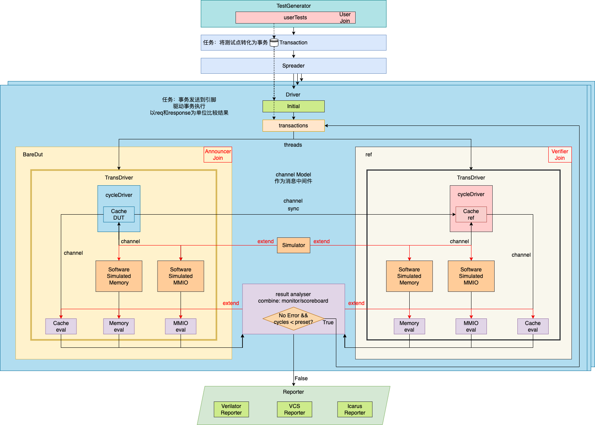
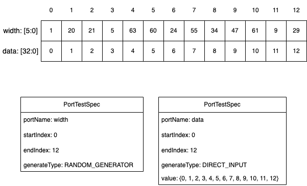

# MLVP Tutorial

## User Group

MLVP的用户群体分为两种角色：

- Announcer: 发布验证需求的社区管理者
- Verifier: 参与验证的社区专家

MLVP将提供对两者使用友好的框架和工具

## MLVP Framework and Project Structure

### Framework and Definations

当前版本MLVP框架如下：



由框架图可知，MLVP框架由若干重要组件构成：

- `Database`(`Databuffer`): 内存数据库/缓冲区，辅助多模块交互，完成数据解藕
- `Transaction`: 由用户测试样例准备事务数据库，测试以事务形式承载，一个测试节点（线程）运行一个测试序列，其中包含多个事务
    - `userTests`: [Verifier] 测试样例用户输入
        - `TestGenerator`: [Verifier] 使用API生成测试样例
- `Channel`: 作为组件之间通信的管道，组件通过管道传输事务、以及不视为事务的信息，构建时每个组件之间、dut组件和ref对应组件之间都已经添加管道，基本组件为`Dut/RefUnitDriver, SimulatorDriver`，若其子实例也需要使用`Channel`，也可以将`shared_ptr`向其传递
- `Spreader`: 根据测试序列的并行性要求发射事物给驱动线程
- `Driver`: 驱动模块，最重要的设计
    - `Driver`: 顶层Driver模块，同时驱动DUT和REF线程完成测试，屏蔽DUT与REF的不同接口
    - `DriverModel`: 所有驱动模块的父类，为统一接口而生
    - `TransDriverModel`: 以事务形式驱动下层基于时钟驱动的Driver，由于Dut/Ref的事务驱动Driver行为接近，因此提取公共部分称为该父类
        - `DutTransDriver/RefTransDriver`，但设一层cycleDriver目前不必要，直接将底层模块的Driver按照cycle来处理即可
            - `DutUnitDriver`: [Announcer] 驱动DUT的模块，将DUT运行函数进行一层抽象，屏蔽不同DUT的接口与设计细节
                - `DUT`: [Announcer] 待测单元模块
            - `RefUnitDriver`: [Verifier] 驱动REF的模块，将REF运行函数进行一层抽象，屏蔽不同REF的接口与设计细节
                - `Ref`: [Verifier] 用户高级语言实现模块参考模型
            - `SimulatorDriver`: [V/A] `Simulator`定义见下方`Simulator`组件，用户/发布者实现对`Simulator`进行事务/时钟驱动
- `Simulator`: [V/A] 此模块的出现是为了解决当待测模块单元可能有其他依赖模块的情况，比如`Cache`模块依赖`Memory`，我们称此时用户需要**模拟**依赖模块，实现依赖模块的模拟器，模拟器继承自`Simulator`类，主要实现`exec`方法供驱动使用，完成事务级功能模拟
- `Evaluator`: 用户可自定义事务dut/ref的比较方式，用户通过事务结果信号来判断是否符合要求
- `Utility`: 一些整合功能的工具
    - `GlobalTimer`: 本框架还实现了全局时钟，在多线程以及异步的情况下使得时钟能够同步，本框架提供两种方式：
        - `GlobalMachineTimer`: 基于系统时钟，固定时钟时长
        - `GlobalUserTimer`: 用户可自定义时钟时间增加的位置，通常适用于DutDriver按拍来设计时用户需要其他组件按照Dut的Cycle同步的情况，方便时钟对齐
    - `RandomGenerator`: 全局随机数生成器，基于C++ `mt19937`和`uniform`分布
- `Reporter`: 整合`Driver`输出的中间结果，对不同模拟器的结果分析方法进行封装，通过配置完成正确调用

### Project Structure

项目目录结构如下，各个目录作用及同上述框架组件的关系见注释

```txt
.
|-- assets                  // Project static resources
|-- bin                     // Binaries output
|-- config                  // Configuration in json
|-- design
|-- doc                     // Documentaion
|-- include                 // Header files, same structure with sources
|   `-- MCVPack                 // DUT header files [component]
|       `-- BareDut
|-- log                     // Middle output
|   `-- memory                  // Module name
|       |-- Driver0                 // Driver threads output, waveforms are here
|-- report                  // Total report
|   `-- memory                  // Module name, coverage reports are here
|-- scripts                 // Scripts help automation
|-- src                     // Cpp sources
|   |-- Channel                 // Channel between Drivers
|   |-- Config                  // Configuration parser
|   |-- Database                // Database structure
|   |-- Drivers                 // Drivers [component]
|   |-- Evaluator               // Evaluators [component]
|   |-- Library                 // Library functions
|   |-- Reporter                // Reporter [component]
|   |-- Simulator               // Simulator [component]
|   |-- Spreader                // Spreader [component]
|   |-- TestGenerator           // Generate tests multi-language tools
|   `-- Transaction             // Transaction [component]
|-- tests                   // Test everything
|-- third-party             // Third party dependencies
|   `-- include
`-- tools                   // Neccessary tools for automation
```

## Usage

本项目提供了使用模板：根目录下[templates/main.cpp](https://gitee.com/yaozhicheng/mlvp/blob/master/template/main.cpp)，根据需求替换以Your提示的用户定义模块，填充逻辑即可，将新文件放在[src/main.cpp](https://gitee.com/yaozhicheng/mlvp/blob/master/src/main.cpp)，以`cmake`的方式编译运行即可，这部分可参考[Quick Start](./index.md#Quick-Start)

具体的每步操作说明可以参考模板或已经提供的[src/main.cpp](https://gitee.com/yaozhicheng/mlvp/blob/master/src/main.cpp)

### Test Generator API Tutorial

#### C++

##### Random Generator Model

API:

```cpp
bool addTestPoint();
bool addSerialTest(int testNum);
bool addSerialTestsSet(std::vector<int> serialTestSize);
```

分别对应测试点、测试序列、整个测试集的随机生成

##### PortSpec Generator Model



按照端口和index设置输入模式，指定端口和index起始可设计模式，首先给出相关数据结构：

`PortTestSpec`数据结构如下：

```cpp
struct PortTestSpec {
    std::string portName;
    int startIndex;
    int endIndex;
    GeneratorType generatorType;
    MLVP::Type::Data maxVal;                                            // 用户输入可只传入bitwidth，输入进行转换后此处会存放真正上限值
    MLVP::Type::SerialData value;                                       // 若用户直接输入，则使用该项作为测试值，若该项size = 1，则[startIndex, endIndex]内全部使用该值，若用户使用随机模式，通过该项传入随机最大值限定
    std::function<bool(MLVP::Type::Data)> constrain;                    // 该项针对随机数生成，确保生成结果符合条件，但该方法很低效，不满足条件的随机数会不断重新生成
    std::function<MLVP::Type::Data(MLVP::Type::Data)> postHandler;      // 巧妙使用value和postHandler是高效的随机数产生方法，能够取代constrain生成良好随机数

    PortTestSpec(std::string inPortName, int inStartIndex, int inEndIndex, GeneratorType inGeneratorType) : portName(inPortName), startIndex(inStartIndex), endIndex(inEndIndex), generatorType(inGeneratorType) {}
    ~PortTestSpec() = default;
};
```

GeneratorType对应前两种模式的其中之一，正确的输入是：

```cpp
enum class GeneratorType {
    DIRECT_INPUT = 1,
    RANDOM_GENERATOR = 2
};
```

其中之一，选择`DIRECT_INPUT`时，若value值只给了1个则全部使用改值填充，否则`value.size() == endIndex - startIndex + 1`是必须成立的，将会用输入的value值填充区间

另外，允许区间的定义不连续，但需要注意的是，未定义的区间值都为0

API:

```cpp
bool addPortTestSpec(std::string portName, int startIndex, int endIndex, GeneratorType generatorType, const MLVP::Type::SerialData &value, bool isBitWidth);
bool addPortTestSpec(std::string portName, int startIndex, int endIndex, GeneratorType generatorType, const MLVP::Type::SerialData &value, bool isBitWidth, std::optional<std::function<bool(MLVP::Type::Data)>> inConstrain, std::optional<std::function<MLVP::Type::Data(MLVP::Type::Data)>> inPostHandler);

void generateSerialTest(bool autoclear = true);
void clearSerialTest();
```

Verifier应使用`addPortTestSpec`对端口值信息按照测试点进行填充，而后使用`generateSerialTest`生成最终的测试样例，clear的作用是generate完成后清楚上一步生成内容，也可以在此基础上继续添加

使用参考[TestGenerator/generatorHelper.h](https://gitee.com/yaozhicheng/mlvp/blob/master/include/TestGenerator/generatorHelper.h)

