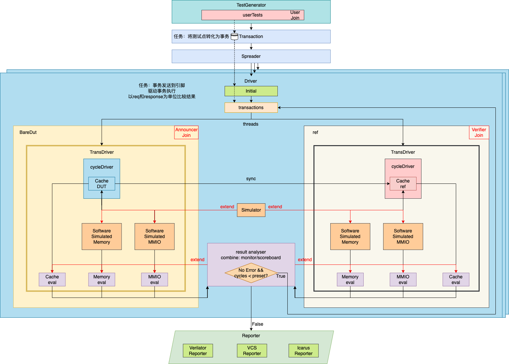
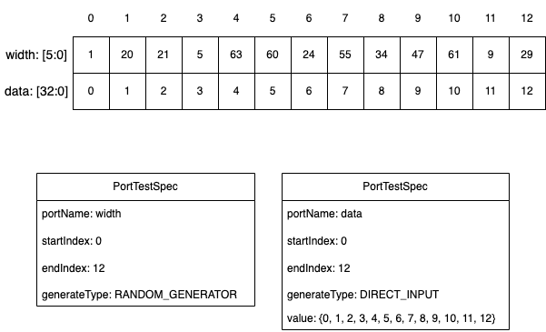

# MVM Tutorial

## User Group

MVM的用户群体分为两种角色：

- Announcer: 发布验证需求的社区管理者
- Verifier: 参与验证的社区专家

MVM将提供对两者使用友好的框架和工具

## MVM Framework and Project Structure

### Framework

当前版本MVM框架如下：



由框架图可知，MVM框架由六个重要组件构成：

- `Database`(`Databuffer`): 内存数据库/缓冲区，辅助多模块交互，完成数据解藕
- `Sequencer`: 整合用户输入测试样例
    - `userTests`: [Verifier] 测试样例用户输入
        - `TestGenerator`: [Verifier] 使用API生成测试样例
- `Transaction`: 由用户测试样例准备事务数据库
- `Spreader`: 根据测试序列的并行性要求发射事物给驱动线程
- `Driver`: 驱动模块，最重要的设计
    - `Driver`: 顶层Driver模块，同时驱动DUT和REF线程完成测试，屏蔽DUT与REF的不同接口
    - `DutDriver`: [Announcer] 驱动DUT的模块，将DUT运行函数进行一层抽象，屏蔽不同DUT的接口与设计细节
        - `DUT`: [Announcer] 待测单元模块
    - `RefDriver`: [Announcer] 驱动REF的模块，将REF运行函数进行一层抽象，屏蔽不同REF的接口与设计细节
        - `Ref`: [Verifier] 用户高级语言实现模块参考模型
    - `resultAnalyser`: 评估测试输出，相当于UVM Scoreboard
- `Reporter`: 整合`Driver`输出的中间结果，对不同模拟器的结果分析方法进行封装，通过配置完成正确调用

### Project Structure

项目目录结构如下，各个目录作用及同上述框架组件的关系见注释

```txt
.
|-- assets                  // Project static resources
|-- bin                     // Binaries output
|-- config                  // Configuration in json
|-- data                    // User generate tests in json
|-- doc                     // Documentaion
|-- include                 // Header files, same structure with sources
|   `-- MCVPack                 // DUT header files [component]
|       `-- BareDut
|           |-- Memory
|           `-- Mux
|-- log                     // Middle output
|   `-- memory                  // Module name
|       |-- Driver0                 // Driver threads output, waveforms are here
|-- report                  // Total report
|   `-- memory                  // Module name, coverage reports are here
|-- scripts                 // Scripts help automation
|-- src                     // Cpp sources
|   |-- Config                  // Configuration parser
|   |-- Database                // Database structure
|   |-- Driver                  // Driver [component]
|   |-- Library                 // Library functions
|   |-- Reporter                // Reporter [component]
|   |-- Sequencer               // Sequencer [component]
|   |-- Spreader                // Spreader [component]
|   |-- TestGenerator           // Generate tests multi-language tools
|   `-- Transaction             // Transaction [component]
|-- tests                   // Test everything
|-- third-party             // Third party dependencies
|   `-- include
`-- tools                   // Neccessary tools for automation
```

## Methodology

MVM的方法学理论与UVM类似：根本目的是利用高度并行化的高效验证手段完成代码全覆盖单元测试，但具体任务与UVM截然不同，为两组用户便利，必须保证框架具有对所有单元测试的适用性，且API具有最佳的用户易用性

MVM验证方法学如下：

### 角色任务

#### Announcer

- 完成测试的添加，完成测试需求的编写
- 框架的生成
- DUT Driver的实现
    - 由于接口间交互和输入模式的复杂性，暂不支持自动生成，待需求明确后会列入Feature Requests

#### Verifier

- 阅读测试需求
- 依照REF接口编写高级语言的Reference Model
- 利用`TestGenerator`API编写测试输入
- 运行测试，不断提高覆盖率、减小测试消耗时间

目前仅支持C++接口，其他语言API开发中

#### MVP System

> MVP, Multi-language Verification Platform

- 用户得分模型：
    - 正确结果：综合覆盖率结果和测试时间，以这两项指标评判测试的全面性和性能
        - 若有更好设计，提Issue [Design Improvement]，得分$\times M$
        - 直接提交Pull Request [Design Improvement]，得分$\times N$
    - 错误结果：
        - 用户Reference Model本身有Bug，不得分
        - 用户Reference Model无误，与正确结果最高得分相同
        - 提Issue [Bug Solution]，主动提出修正方法，得分$\times M$
        - 直接提交Pull Request [Bug Solution]修正代码，得分$\times N$
- 反馈模型：系统自动及时通知设计人员错误设计和性能结果

### 实施步骤

1. [Announcer] 明确测试需求，将测试单元放入`design/[TestModule]`，在配置中输入测试单元名称和顶层模块
    - 暂时不支持配置
2. [Announcer] 项目根目录运行verilator头文件生成脚本`./script/gencode.sh`
    - Verilog头文件生成并放入`include/MCVPack/BareDut/[TestModule]`
3. [Announcer] 项目根目录运行RefDrivers/Ref接口生成脚本`python3 tools/generatePortsInfo.py`
    - 生成顶层模块接口信息放入`include/Database/designPortsGen.h`
4. [Announcer] 根据模块运行逻辑编写DUT Driver类，继承自`DutUnitDriver`(位于`include/Drivers/dutUnitDriver.h`)，放在`src/main.cpp`中，Driver的编写参考文件中`DutMemoryDriver`，并且参考[Verilator Example](https://github.com/verilator/verilator/tree/master/examples)
    - 核心：实现`bool drivingStep() {}`函数，对DUT接口硬赋值
5. [Verifier] 根据硬件描述和实现，使用高级语言编写Reference Model，继承自`Ref`类(位于`include/RefPack/ref.h`)，放在`src/main.cpp`中
    - 核心：实现`void exec() {}`函数
5. [Verifier] 根据硬件描述和实现，编写Ref Driver类，继承自`RefUnitDriver`类(位于`include/Drivers/refUnitDriver.h`)，放在`src/main.cpp`中，Driver的编写参考文件中`RefMemoryDriver`
    - 核心：实现`void drivingStep() {}`函数
7. [Verifier] 根据TestGenerator [API规范](#test-generator-api-tutorial)，在`src/main.cpp`主函数中编写测试样例
5. [Verifier] 在`src/main.cpp`主函数中完成整个框架组件的连接，可参考现有文件
8. [Verifier] 提交运行程序，生成正确性、覆盖率和性能报告，返回5进行优化或Debug
9. [System] 向设计人员反馈结果


### Test Generator API Tutorial

#### C++

本项目设计了三种测试生成模型：Direct Input Model, Random Generator Model, PortSpec Generator Model，对应生成三种不同类型的输入，第三种是前两种模式的混合，最为灵活

##### Direct Input Model

API:

```cpp
bool addSerialTest(MVM::Type::SerialTest testSet);
bool addTestPoint(MVM::Type::TestPoint test);
```

分别对应输入二维测试序列的数据，和一维测试点的数据

维度使用`std::vector`，数据类型`unsigned long long`

##### Random Generator Model

API:

```cpp
bool addTestPoint();
bool addSerialTest(int testNum);
bool addSerialTestsSet(std::vector<int> serialTestSize);
```

分别对应测试点、测试序列、整个测试集的随机生成

##### PortSpec Generator Model



按照端口和index设置输入模式，指定端口和index起始可设计模式，首先给出相关数据结构：

`PortTestSpec`数据结构如下：

```cpp
struct PortTestSpec {
    std::string portName;
    int startIndex;
    int endIndex;
    GeneratorType generatorType;
    std::vector<unsigned long long> value;

    PortTestSpec(std::string inPortName, int inStartIndex, int inEndIndex, GeneratorType inGeneratorType) : portName(inPortName), startIndex(inStartIndex), endIndex(inEndIndex), generatorType(inGeneratorType) {}
    ~PortTestSpec() = default;
};
```

GeneratorType对应前两种模式的其中之一，正确的输入是：

```cpp
enum class GeneratorType {
    DIRECT_INPUT = 1,
    RANDOM_GENERATOR = 2
};
```

其中之一，选择`DIRECT_INPUT`时，若value值只给了1个则全部使用改值填充，否则`value.size() == endIndex - startIndex + 1`是必须成立的，将会用输入的value值填充区间

另外，允许区间的定义不连续，但需要注意的是，未定义的区间值都为0

API:

```cpp
bool addPortTestSpec(PortTestSpec portTestSpec);
bool addPortTestSpec(std::string portName, int startIndex, int endIndex, GeneratorType generatorType);
bool addPortTestSpec(std::string portName, int startIndex, int endIndex, GeneratorType generatorType, std::vector<unsigned long long> value);

void generateSerialTest(bool autoclear = true);
void clearSerialTest();
```

Verifier应使用`addPortTestSpec`对端口值信息按照测试点进行填充，而后使用`generateSerialTest`生成最终的测试样例，clear的作用是generate完成后清楚上一步生成内容，也可以在此基础上继续添加

使用参考`tools/TestGenerator/src/main.cpp`

